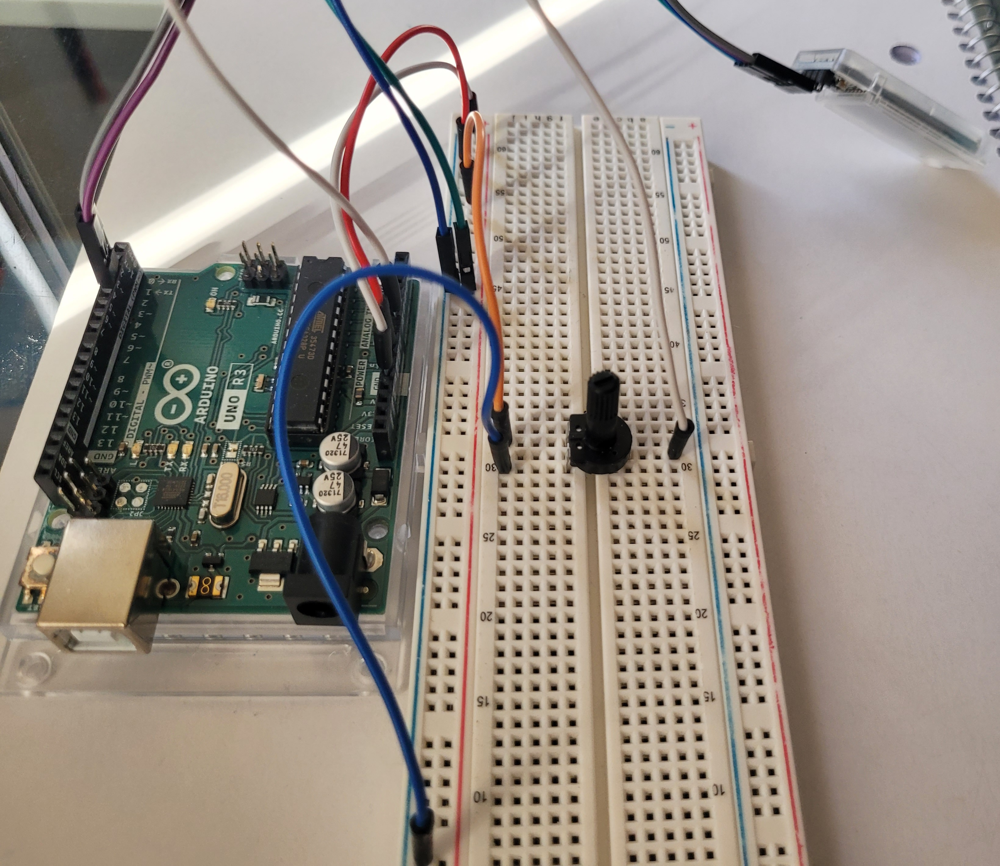
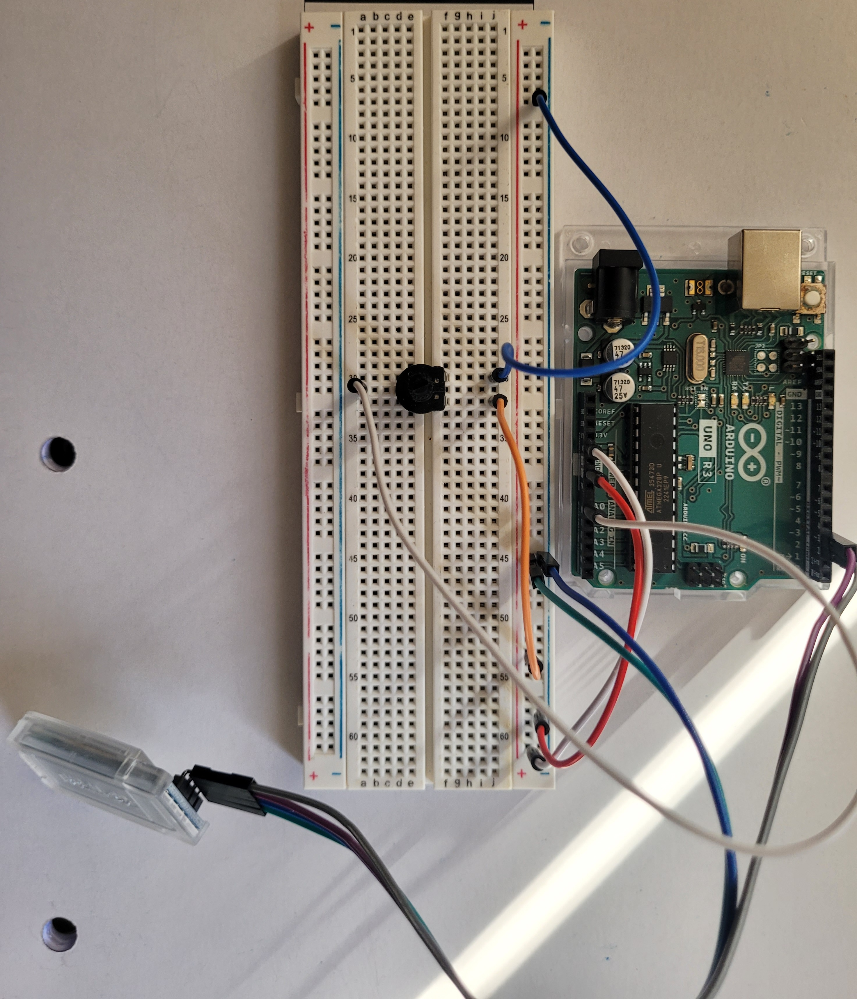
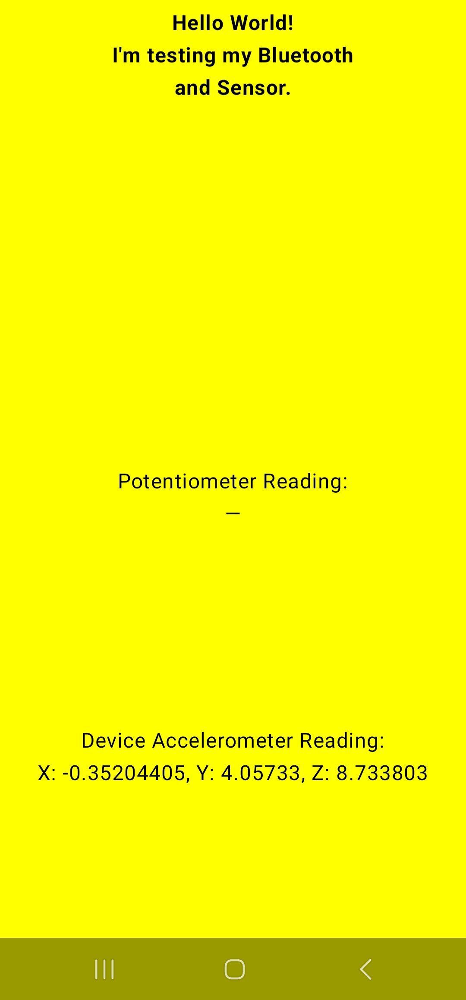

# AndroidBluetoothSensorApp
Basic "Hello World" app made using Android Studio. App accesses sensors from phone and from Arduino. The sensors' readings are then printed on the screen.

Assignment:
1. Download Android Studio. Make a "Hello World" App using Android Studio
2. Access any sensor and print the reading to the system

Mini Project Images:

Both Sensor readings work, but this image only shows when the Bluetooth Module is Disconnected 

